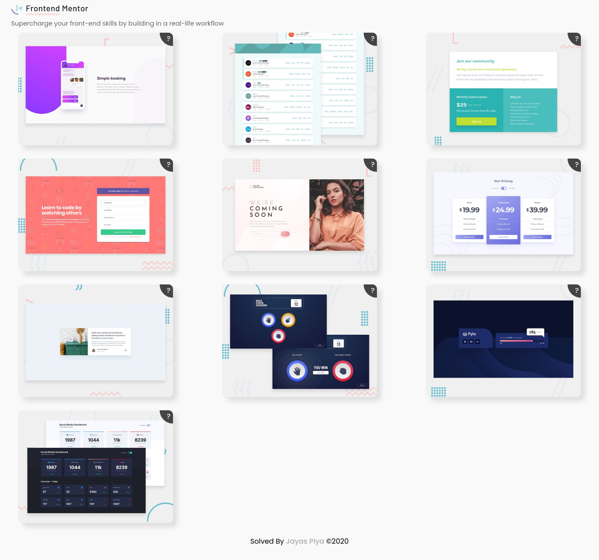

# Frontend Mentor Challanges

Frontend Mentors Solution

## Table of contents

- [Technologies](#technologies)
- [Challanges](#challanges)
- [Code Example](#code-example)
- [Status](#status)
- [Inspiration](#inspiration)
- [Contact](#contact)

## Technologies

- HTML5
- CSS
- SCSS
- JavaScript

## Challanges

- Chat app CSS illustration
- Job listings with filtering
- Single Price Grid Component
- Intro component with sign-up form
- Base Apparel coming soon page
- Pricing component with toggle
- Article preview component
- Rock, Paper, Scissors game
- Fylo data storage component
- Social media dashboard with theme switcher

## Code Examples

Show examples of usage:
`Console.log("HELLO WORLD!!!")`
`Console.log("This is just for test.")`

## Status

Project is: _in progress_

## Inspiration

[Frontend Mentor](www.frontendmentor.io/)Supercharge your front-end skills by building in a real-life workflow

## Contact

Created by [@zayazzp](https://www.instagram.com/zayazz.p/) - feel free to contact me!
